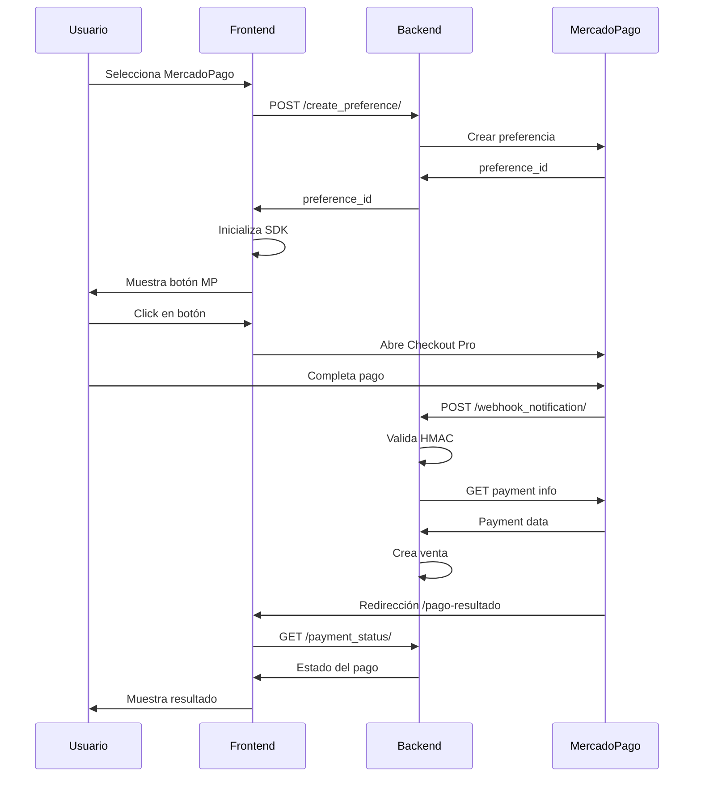

# ✅ Integración Completa de MercadoPago

## 🎯 Resumen Ejecutivo

Se ha implementado exitosamente un sistema de pagos con MercadoPago para el sistema de tickets, incluyendo tanto backend (Django) como frontend (Vue.js).

## 📦 Componentes Implementados

### Backend (Django REST Framework)

**Servicios:**
1. `payment_status_mapper.py` - Mapeo de estados de pago
2. `webhook_validation_service.py` - Validación HMAC de webhooks
3. `order_creation_service.py` - Creación de órdenes
4. `cart_reconciliation_service.py` - Reconciliación de carrito
5. `mercadopago_webhook_service.py` - Orquestador principal

**API Endpoints:**
```
POST   /api/ventas/mercadopago/create_preference/     - Crear preferencia de pago
POST   /api/ventas/mercadopago/webhook_notification/ - Recibir notificaciones
GET    /api/ventas/mercadopago/payment_status/       - Consultar estado de pago
```

**Configuración:**
- Integración con mercadopago SDK 2.2.1
- Validación HMAC-SHA256 en webhooks
- Gestión de estados de pago
- Creación automática de ventas al aprobar pago

### Frontend (Vue.js 3)

**Componentes:**
1. `mercadopagoService.js` - Servicio de comunicación con backend
2. `Checkout.vue` (modificado) - Integración del botón de pago
3. `PagoResultado.vue` - Vista de resultado de pago
4. SDK de MercadoPago v2 integrado

**Rutas:**
```
/checkout        - Proceso de pago (incluye opción MercadoPago)
/pago-resultado  - Resultado y verificación de pago
```

**Características:**
- Selección de método de pago con interfaz moderna
- Inicialización automática del SDK
- Estados de carga y error
- Verificación de estado de pago
- Limpieza automática del carrito

## 🚀 Configuración Rápida

### 1. Backend

Edita `backend/config/settings.py`:

```python
# MercadoPago Configuration
MERCADOPAGO_ACCESS_TOKEN = 'TEST-xxxx-your-access-token'
MERCADOPAGO_WEBHOOK_SECRET = 'your-webhook-secret-key'
```

Instala dependencia:
```bash
cd backend
pip install mercadopago==2.2.1
```

### 2. Frontend

Edita `frontend/.env`:

```env
VITE_MERCADOPAGO_PUBLIC_KEY=TEST-xxxx-your-public-key
```

Inicia el servidor:
```bash
cd frontend
npm run dev
```

## 📋 Flujo Completo



## 🔄 Estados de Pago

| Estado MP | Estado Sistema | Acción |
|-----------|---------------|---------|
| `approved` | `APROBADO` | ✅ Crea venta y tickets |
| `pending` | `PENDIENTE` | ⏳ Espera confirmación |
| `in_process` | `PENDIENTE` | ⏳ Procesando |
| `rejected` | `RECHAZADO` | ❌ No crea venta |
| `cancelled` | `RECHAZADO` | ❌ No crea venta |

## 🧪 Pruebas con Tarjetas de Test

### Pago Aprobado
```
Número: 5031 7557 3453 0604
CVV: 123
Vencimiento: 11/25
Nombre: APRO
```

### Pago Rechazado (Sin fondos)
```
Número: 5031 7557 3453 0604
CVV: 123
Vencimiento: 11/25
Nombre: FUND
```

[Todas las tarjetas de prueba](https://www.mercadopago.com.pe/developers/es/docs/checkout-pro/additional-content/test-cards)

## ✅ Checklist de Implementación
## 🔐 Seguridad

✅ **Implementado:**
- Autenticación requerida en todos los endpoints
- Validación HMAC-SHA256 en webhooks
- No se exponen credenciales sensibles
- Comunicación HTTPS
- Tokens en headers HTTP
- Sanitización de datos de entrada

## 🎓 Flujo de Usuario

1. **Usuario agrega tickets al carrito**
   - Navega por eventos
   - Selecciona presentación y zona
   - Agrega al carrito

2. **Usuario va al checkout**
   - Revisa resumen de compra
   - Ve total con cargo de servicio (5%)

3. **Usuario selecciona MercadoPago**
   - El botón de MP se inicializa automáticamente
   - Ve indicador de carga durante inicialización
   - Aparece botón de pago de MP

4. **Usuario completa el pago**
   - Click en botón de MercadoPago
   - Se abre modal de Checkout Pro
   - Ingresa datos de tarjeta
   - Confirma pago

5. **Sistema procesa el pago**
   - MercadoPago notifica al backend vía webhook
   - Backend valida la notificación
   - Backend crea la venta y los tickets
   - MercadoPago redirige al usuario

6. **Usuario ve el resultado**
   - Frontend consulta estado del pago
   - Muestra resultado visual (aprobado/pendiente/rechazado)
   - Carrito se limpia si fue aprobado
   - Puede ver sus tickets

## 🚧 Para Producción

### 1. Credenciales de Producción

Cambia en `settings.py`:
```python
MERCADOPAGO_ACCESS_TOKEN = 'APP-xxxx-production-token'
```

Cambia en `.env`:
```env
VITE_MERCADOPAGO_PUBLIC_KEY=APP-xxxx-production-public-key
```

### 2. URL del Webhook

**Opción A: Dominio propio**
```python
# Ya estás listo, el webhook funcionará automáticamente
```

### 3. Configurar en Panel de MercadoPago

1. Ingresa a [MercadoPago Developers](https://www.mercadopago.com/developers/panel/app)
2. Selecciona tu aplicación
3. Ve a "Webhooks" o "Notificaciones IPN"
4. Configura la URL del webhook
5. Selecciona eventos: `payment`, `merchant_order`
6. Guarda y verifica que esté activo

## 🐛 Troubleshooting Común

### Backend

**Error: "Invalid signature"**
```python
# Verificar MERCADOPAGO_WEBHOOK_SECRET en settings.py
# Debe coincidir con el secreto en el panel de MP
```

**Error: "Access token not found"**
```python
# Verificar MERCADOPAGO_ACCESS_TOKEN en settings.py
```

### Frontend

**Botón de MP no aparece**
```bash
# Verificar en consola del navegador
# Verificar VITE_MERCADOPAGO_PUBLIC_KEY en .env
# Reiniciar servidor: npm run dev
```

**Error CORS**
```python
# Agregar en settings.py:
CORS_ALLOWED_ORIGINS = [
    "http://localhost:5173",
    "https://tu-dominio.com",
]
```